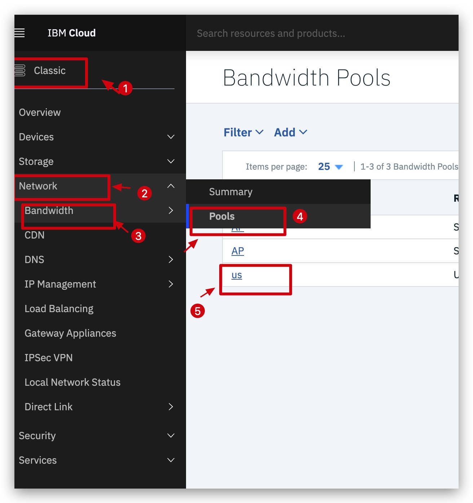
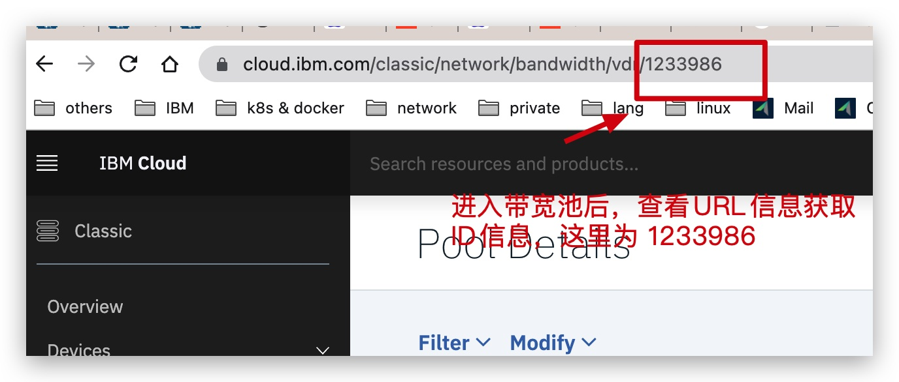

# 批量添加设备到带宽池中 


## 设置环境变量
```
echo SL_USERNAME=<replace-it> > env.sh
echo SL_API_KEY==<replace-it> >> env.sh
source env.sh
```

## 步骤 
  - 获取带宽池ID, 请注意带宽池是按照区域划分的，达拉斯 华盛顿等DC的设备只能加入北美（加拿大，美国）带宽池，像东京DC是没法加入的，东京DC需要加入到亚太的带宽池
  - 运行脚本 批量添加某个数据中心等所有设备到目标带宽池中


### 获取带宽池ID 
   1. 进去目标带宽池
     选择经典架构 -> 网络 -> 带宽 -> 池子 -> 目标带宽池 -> URL 地址中 标识带宽池ID信息






### 运行脚步 
  
  #### 使用
    - 把数据中心 `dal09`的设备加入到北美的带宽池中， 其中1234004 为带宽池ID
     ./add_devices_to_pool.py -d dal09  -p 1234004

## 参数
- `-k` Softlayer API key
- `-u` Softlayer username
- `-p` 带宽池ID，通过第二步获取到的
- `-d` 数据中心代码 